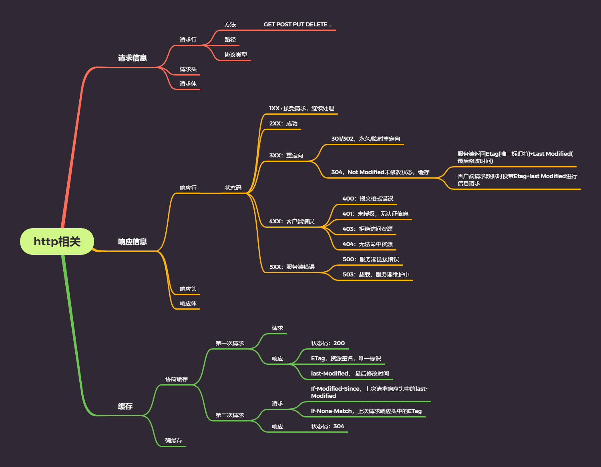

# 网络
>[冴羽](https://juejin.im/post/5e718ecc6fb9a07cda098c2d)
## http协议

 ### 如何理解http协议？
 - 生活中的协议即甲乙双方或多方按照事先承诺、约定的方式进行工作。例如食堂规定中午11:30-13:30提供午餐，那我们只能在这个时间点去食堂就餐。
 - http协议即客户端的按照一定的规则向服务端请求数据，或发送数据，而服务端也按照一定的规则向客户端进行回应
## cookie
>[待整理](https://juejin.im/post/5e718ecc6fb9a07cda098c2d)
