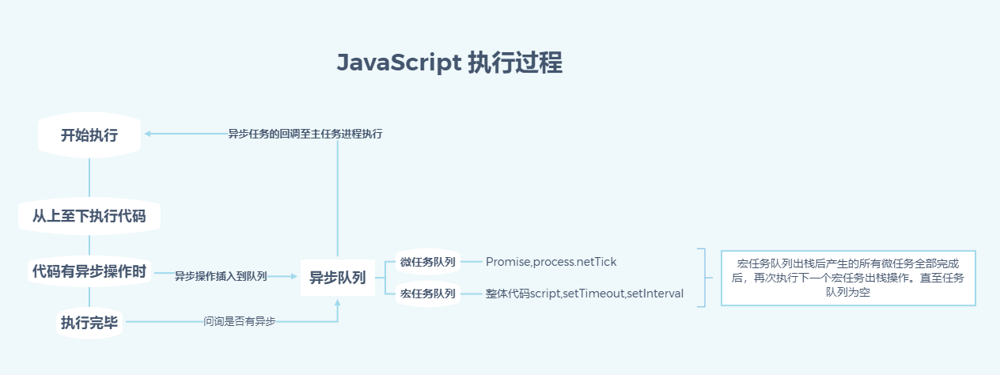

# JS

::: tip

## 变量提升

:::

### 变量声明提升的原因：

当执⾏ JS 代码时，会⽣成执⾏环境。这个过程有两个阶段。第⼀个阶段是创建的阶段，JS 解释器会找出需要提升的<b>变量和函数</b>，并且给他们<b>提前</b>在内存中开辟好空间，函数的话会将整个函数存⼊内存中(可以运行)，变量只声明并且赋值为 undefined。第⼆个阶段，也就是代码执⾏阶段，我们可以直接提前使⽤，也就形成了声明提升现象。

- 在提升的过程中，相同的函数会覆盖上⼀个函数。
- 函数优先于变量提升

### 变量声明提升的现象：

```js
b(); // call b
console.log(a); // undefined

var a = "Hello world";
function b() {
  console.log("call b");
}
```

::: tip

## JavaScript 异步执行机制

:::

> 参考[ssssyoki](https://juejin.im/post/59e85eebf265da430d571f89)

### 1.js 的异步

javascript 是一门<em>单线程</em>语言，不管是什么新框架新语法糖实现的所谓异步，其实都是用同步的方法去模拟的，牢牢把握住单线程这点非常重要。

### 2.JavaScript 执行过程



- 事件循环(Event Loop)是 js 实现异步的一种方法，也是 js 的执行机制。
  - js 执行过程中，同步和异步任务分别进入不同的执行"场所"，同步的进入主线程，异步的回调函数插入到异步队列。
  - 主线程内的任务执行完毕为空，会去异步队列读取对应的函数，进入主线程执行。
  - 上述过程会不断重复，也就是常说的 Event Loop(事件循环)。
- 异步队列又分微任务队列和宏任务队列
  - 常用的微任务队列:Promise,process.netTick(node)
  - 常用的宏任务队列:整体代码 script,setTimeout,setInterval
  - 异步队列执行过程：宏任务队列出栈后产生的所有微任务全部完成后，再次执行下一个宏任务出栈操作。直至任务队列为空

### 3.javascript 的执行和运行

执行和运行有很大的区别，javascript 在不同的环境下，比如 node，浏览器，Ringo 等等，执行方式是不同的。而运行大多指 javascript 解析引擎，是统一的。
### 实例
```js
setTimeout(() => {
  console.log("set");
});
new Promise(resolve => {
  console.log("p");
  resolve("then");
}).then(res => {
  console.log(res);
});
console.log(1);
//代码第一次顺序执行后，打印p,1
//此时，宏任务队列：[setTimeout()]
//此时，微任务队列：[then()]
//执行微任务队列代码 ，打印then
//执行宏任务队列代码 ，打印set
//打印结果：p 1 then set
```

```js
setTimeout(() => {
  console.log("set1");
  new Promise(res => {
    res();
  }).then(() => {
    new Promise(res => {
      res();
    }).then(() => {
      console.log("then4");
    });
    console.log("then2");
  });
});
new Promise(res => {
  console.log("p1");
  res();
}).then(() => {
  console.log("then1");
});
setTimeout(() => {
  console.log("set2");
});
console.log(1);
new Promise(res => {
  res();
}).then(() => {
  console.log("then3");
});
//代码第一次顺序执行后，打印p1,1
//此时，宏任务队列：[setTimeout(set1),setTimeout(set2)]
//此时，微任务队列：[Promise(then1),Promise(then3)]
//执行微任务队列代码 ，打印then1,then3
//微任务队列空
//执行宏任务队列代码第一个，打印set1
//宏任务执行后，宏任务队列：[setTimeout(set2)]
//宏任务执行后，微任务队列：[Promise(then2)]
//执行微任务队列代码 ，打印then2
//微任务执行后，宏任务队列：[setTimeout(set2)]
//微任务执行后，微任务队列：[Promise(then4)]
//执行微任务队列代码 ，打印then4
//微任务队列空
//执行宏任务队列代码第一个，打印set2
//宏任务执行后，宏任务队列：[]
//宏任务执行后，微任务队列：[]
//执行结束。顺序依次是p1-2-then1-then3-set1-then2-then4-set2
```