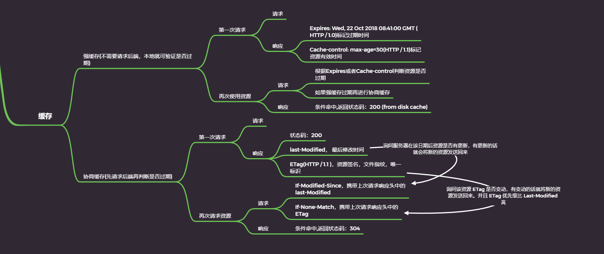

# 优化

::: tip

## 1.浏览器缓存

:::

### 1.良好的缓存策略可以降低资源的重复加载提⾼⽹⻚的整体加载速度。

### 2.通常浏览器缓存策略分为两种：强缓存和协商缓存。

- 强缓存

  * 实现强缓存可以通过两种响应头实现： <b>Expires</b> 和 <b>Cache-Control</b> 。
  * 强缓存表示在缓存期间不需要请求， state code 为 <b>200</b>

  ```js
   Expires: Wed, 22 Oct 2018 08:41:00 GMT
   ```

  Expires 是 HTTP / 1.0 的产物，表示资源会在 Wed , 22 Oct 2018 08:41:00 GMT 后过期，需要再次请求。并且 Expires 受限于本地时间，如 果修改了本地时间，可能会造成缓存失效。

     ```js
     Cache-control: max-age=30
     ```

  Cache-Control 出现于 HTTP / 1.1 ，优先级⾼于 Expires 。该属性表示资源会在 30 秒后过期，需要再次请求

- 协商缓存
    * 如果强缓存过期了，我们就可以使⽤协商缓存来解决问题。协商缓存需要请求，如果缓存有 效会返回 304 。
    * 协商缓存需要客户端和服务端共同实现，和强缓存⼀样，也有两种实现⽅式:Last-Modified 和 If-Modified-Since、ETag 和 If-None-Match

```js
   last-Modified和if-Modified-Since
```

 -  Last-Modified 表示本地⽂件最后修改⽇期， If-Modified-Since 会将 LastModified 的值发送给服务器，询问服务器在该⽇期后资源是否有更新，有更新的话就会将新的资源发送回来
 - 但是如果在本地打开缓存⽂件，就会造成 Last-Modified 被修改，所以在 HTTP / 1.1 出现了 ETag

```js
ETag 和 If-None-Match
```
- ETag 类似于⽂件指纹， If-None-Match 会将当前 ETag 发送给服务器， 询问该资源 ETag 是否变动，有变动的话就将新的资源发送回来。并且 ETag 优先级⽐ Last-Modified ⾼

### 3.选择合适的缓存策略
> 对于⼤部分的场景都可以使⽤强缓存配合协商缓存解决，但是在⼀些特殊的地⽅可能需要选择特殊的缓存策

- 对于某些不需要缓存的资源，可以使⽤ Cache-control: no-store ，表示该资源不需要 缓存 
- 对于频繁变动的资源，可以使⽤ Cache-Control: no-cache 并配合 ETag 使⽤，表示 该资源已被缓存，但是每次都会发送请求询问资源是否更新。 
- 对于代码⽂件来说，通常使⽤ Cache-Control: max-age=31536000 并配合策略缓存使 ⽤，然后对⽂件进⾏指纹处理，⼀旦⽂件名变动就会⽴刻下载新的⽂件
